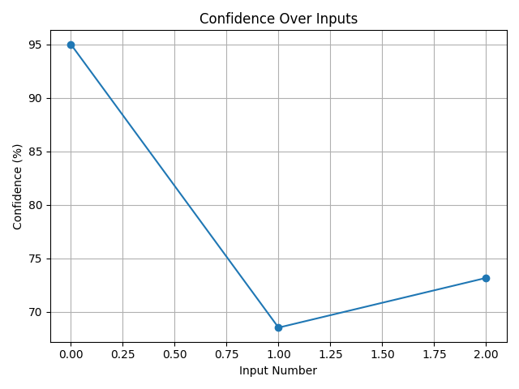

# Self-Healing Text Classifier 🧠

This project implements a **LangGraph-based classification pipeline** that can self-heal by handling low-confidence predictions through a **backup model** and **user clarification**.

## 📁 Project Structure

```
ATG-Task/
├── logs/
│   ├── run.log                   ✅ File-based logs
│
├── models/
│   └── sentiment_model/         ✅ Fine-tuned DistilBERT model
│
├── src/
│   ├── build_graph.py           ✅ LangGraph DAG setup
│   ├── graph_state.py           ✅ Shared state structure
│   └── nodes.py                 ✅ Inference, confidence check, fallback nodes
│
├── cli.py                        ✅ Interactive CLI to test classification
├── logger_config.py              ✅ Custom loguru logging
├── train.py                      ✅ Fine-tune the DistilBERT model
```

---

## 🚀 How to Run Fine-Tuning

1. 📦 Install dependencies:

```
pip install transformers datasets loguru
```

2. ▶️ Run training:

```
python train.py
```

This will fine-tune DistilBERT on the IMDb dataset and save the model to `models/sentiment_model/`.

---

## ⚙️ How to Run the LangGraph CLI

After training is complete:

```
python cli.py
```

You'll see a prompt like:

```
--- Self-Healing Text Classifier ---

Input:
```

You can enter any movie review. Type `exit` to stop.

---

## 🧠 How the CLI Flow Works

1. **InferenceNode** runs prediction using your fine-tuned model.
2. **ConfidenceCheckNode** evaluates confidence:
   - If confidence ≥ 80%, it accepts prediction.
   - If < 80%, it triggers fallback.
3. **FallbackNode**:
   - Tries a zero-shot model (`facebook/bart-large-mnli`).
   - If still low confidence, asks **you** for clarification.
4. The final label is logged and printed.

### 🔁 Example

```
Input: The movie was painfully slow and boring.
[InferenceNode] Predicted label: Positive | Confidence: 54%
[ConfidenceCheckNode] Confidence too low. Triggering fallback...
[FallbackNode] Could you clarify your intent? Was this a positive review?
User: No, it was negative.
Final Label: Negative (Corrected via user clarification)
```

---

## 📊 Bonus Features Added

- ✅ Confidence Curve (saved as `logs/confidence_curve.png` on exit)
- ✅ CLI Fallback Histogram

---


## 🖼️ Sample CLI Execution

Below is a screenshot of the CLI running the classification pipeline with fallback logic and histogram display:



